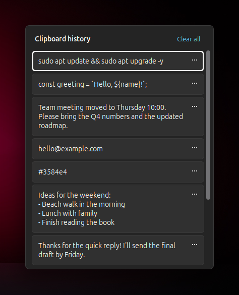
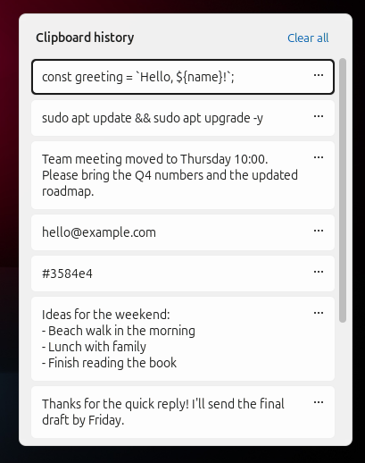
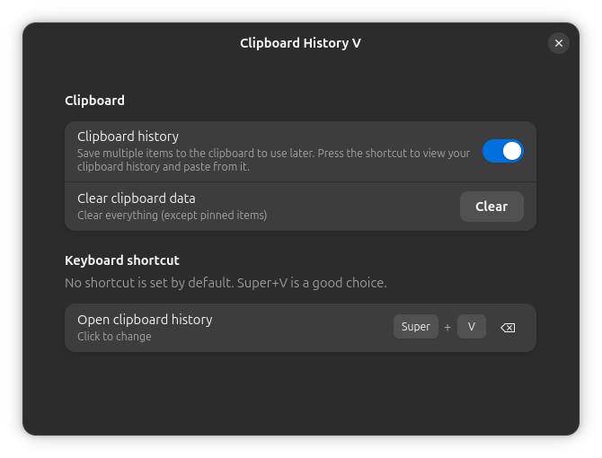

# Clipboard History V

A GNOME Shell extension that shows your clipboard history in a popup next to the text cursor, in the style of the Win+V panel.

<p align="center"> &nbsp; </p>

## Features

- Keeps the last 25 text and image items you copied
- Opens next to the text cursor (or the mouse pointer if there is no cursor)
- Click an item, or press **Enter**, to paste it into the app you were using
- Hold the shortcut's modifier and tap the key again to move down the list; release the modifier to paste
- **…** on each item: Delete, Pin, Clear all
- Pinned items stay at the top and survive restarts
- Follows the system light/dark style
- Works in terminals (pastes with Ctrl+Shift+V there)

## Setup

No keyboard shortcut is set by default. After enabling the extension, open its preferences and choose one. Super+V is a good choice.



## Privacy

This extension reads the clipboard to build the history.

- Unpinned items are kept only in `$XDG_RUNTIME_DIR` (memory), which is cleared when you log out or restart.
- Pinned items are stored in `~/.local/share/clipboard-history-v/`.
- Items that password managers mark as secret (`x-kde-passwordManagerHint`) are never saved.
- Nothing is ever sent over the network.

## Install

From [extensions.gnome.org](https://extensions.gnome.org/extension/11151/clipboard-history-v/) (once the review is finished), or from the [latest release](https://github.com/MBA90/clipboard-history-v/releases/latest):

```bash
gnome-extensions install --force clipboard-history-v.zip
```

Then log out and back in, enable it in the Extensions app, and choose a shortcut in its preferences.

To build the zip from source, run `./pack.sh`.

Supports GNOME Shell 46 to 50.

## License

GPL-2.0-or-later. See [LICENSE](LICENSE).
